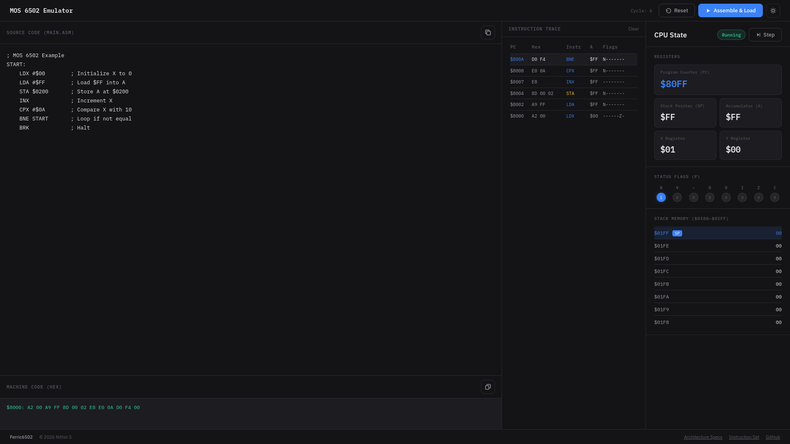

<p align="center">
  
</p>

<h1 align="center">Ferric6502</h1>

<p align="center">
  <strong>A browser-based MOS 6502 CPU emulator powered by Rust and WebAssembly.</strong>
</p>

<p align="center">
  <a href="#features">Features</a> •
  <a href="#screenshot">Screenshot</a> •
  <a href="#getting-started">Getting Started</a> •
  <a href="#how-to-use">How to Use</a> •
  <a href="#architecture">Architecture</a> •
  <a href="#example-program">Example Program</a> •
  <a href="#acknowledgements">Acknowledgements</a> •
  <a href="#license">License</a>
</p>

---

## What is this?

Ferric6502 is a fully functional **MOS 6502 CPU emulator** that runs entirely in the browser. The 6502 was the legendary 8-bit microprocessor that powered the Apple II, Commodore 64, Atari 2600, and the Nintendo Entertainment System. This project lets you write 6502 assembly code, assemble it, and step through it instruction-by-instruction — watching registers, flags, and the stack change in real time.

The CPU core is written in **Rust** and compiled to **WebAssembly** for near-native execution speed. The frontend is a zero-dependency vanilla HTML/CSS/JS application with a modern, dark-themed debugging workspace.

## Features

- ⚡ **Rust + WebAssembly core** — Cycle-accurate 6502 CPU emulation at near-native speed
- 🖥️ **Three-column debugging workspace** — Source editor, instruction trace, and CPU state all visible simultaneously
- 📋 **Live instruction trace** — Watch each executed instruction, its hex encoding, affected register, and flag state
- 🔢 **Full register visibility** — Program Counter, Stack Pointer, Accumulator, X, and Y registers with change highlighting
- 🚩 **Status flag visualization** — All 8 processor flags (N, V, –, B, D, I, Z, C) displayed as interactive indicators
- 📚 **Stack memory inspector** — Real-time view of the $0100–$01FF stack page with the current SP highlighted
- ⌨️ **Keyboard shortcuts** — Press `F8` to step through instructions
- 🎨 **Dark & light themes** — Toggle between themes with the gear icon
- 📦 **Zero dependencies** — No npm, no bundler, no framework — just open `index.html`

## Screenshot



## Getting Started

### Run Locally

Since this is a static site, all you need is any HTTP server. The WASM module is pre-compiled and included in the `pkg/` directory.

```bash
# Clone the repository
git clone https://github.com/NithinS74/Ferric6502.git
cd Ferric6502

# Serve with Python (or any static file server)
python3 -m http.server 8000

# Open in your browser
# → http://localhost:8000
```

> **Note:** You must serve via HTTP (not `file://`) because browsers block WASM loading from local file paths.


## How to Use

1. **Write your code** — Type or paste 6502 assembly in the Source Code editor on the left
2. **Assemble & Load** — Click the `▶ Assemble & Load` button in the top-right. The assembler will compile your source code and load the resulting machine code into the emulated CPU's memory starting at address `$8000`
3. **Step through** — Click `▶ Step` (or press `F8`) to execute one instruction at a time. Watch the Instruction Trace in the middle column and the CPU State on the right update after each step
4. **Observe** — The registers flash green when their values change. Status flags light up in blue when set. The stack inspector highlights the current stack pointer position
5. **Reset** — Click `↻ Reset` to reset the CPU back to its initial state without clearing your source code

### Reading the Instruction Trace

Each row in the trace shows:

| Column | Meaning |
|--------|---------|
| **PC** | Program Counter — the memory address of the instruction |
| **Hex** | The raw bytes of the instruction in hexadecimal |
| **Instr** | The human-readable mnemonic (e.g., `LDA`, `STA`, `BNE`) |
| **A** | The value of the Accumulator register after execution |
| **Flags** | The processor status flags after execution (`NV-BDIZC`) |

## Example Program

Here's a simple program to get you started. It initializes the X register to 0, loads `$FF` into the accumulator, stores it to memory address `$0200`, then loops 10 times:

```asm
; MOS 6502 Example
START:
    LDX #$00        ; Initialize X to 0
    LDA #$FF        ; Load $FF into A
    STA $0200       ; Store A at $0200
    INX             ; Increment X
    CPX #$0A        ; Compare X with 10
    BNE START       ; Loop if not equal
    BRK             ; Halt
```

Paste this into the editor, click **Assemble & Load**, then step through with **F8** and watch:
- The **X register** count from `$00` to `$0A`
- The **Zero flag** flip on the final `CPX` comparison
- The CPU halt when it reaches `BRK`

## Architecture

```
┌──────────────────────────────────────────────────────┐
│                     Browser                          │
│                                                      │
│  ┌──────────┐   ┌──────────────┐   ┌──────────────┐ │
│  │  Editor   │   │  Instruction │   │  CPU State   │ │
│  │  + Hex    │   │    Trace     │   │  + Flags     │ │
│  │  Output   │   │              │   │  + Stack     │ │
│  └────┬─────┘   └──────────────┘   └──────┬───────┘ │
│       │                                    │         │
│       ▼                                    ▲         │
│  ┌─────────┐      ┌───────────┐      ┌────┴────┐    │
│  │assembler│─────▶│  app.js   │─────▶│  WASM   │    │
│  │  .js    │bytes │(Frontend) │calls │  (Rust) │    │
│  └─────────┘      └───────────┘      └─────────┘    │
└──────────────────────────────────────────────────────┘
```

| Layer | Technology | Role |
|-------|-----------|------|
| **CPU Core** | Rust → WebAssembly | Emulates the 6502 processor: registers, memory, status flags, and instruction execution |
| **Assembler** | JavaScript | Parses 6502 assembly source into machine code bytes (two-pass assembler with label resolution) |
| **Frontend** | HTML / CSS / JS | Three-column UI with real-time register diffing, trace logging, and stack visualization |

### Rebuilding the WASM Core (Optional)

The pre-compiled WASM is included in `pkg/`. If you want to modify the Rust source and rebuild:

```bash
# Install wasm-pack
curl https://rustwasm.github.io/wasm-pack/installer/init.sh -sSf | sh

# Build
wasm-pack build --target web --out-dir pkg
```

## Tech Stack

| | Technology |
|---|---|
| 🦀 | **Rust** — CPU emulation core |
| 🕸️ | **WebAssembly** — Browser-native execution of the Rust core |
| 🌐 | **Vanilla HTML/CSS/JS** — Zero-dependency frontend |
| 🔤 | **IBM Plex Mono & Sans** — Typography via Google Fonts |
| 📦 | **wasm-bindgen** — Rust ↔ JavaScript interop |

## Acknowledgements

### Assembler

The 6502 assembler (`assembler.js`) is adapted from [**easy6502**](https://skilldrick.github.io/easy6502/) by [Nick Morgan (skilldrick)](https://github.com/skilldrick). The original assembler is part of the [6502js](https://github.com/skilldrick/6502js) project and is licensed under the [**Creative Commons Attribution 4.0 International License (CC BY 4.0)**](https://creativecommons.org/licenses/by/4.0/).

**Changes made to the original assembler include:**
- Formatting and code style normalization
- Removal of the `isPass2` parameter from `assembleLine` — pass 1 now uses unconditional placeholder fallbacks for unresolved labels
- Updated the `assemble()` return value to a structured `{ error, message, bytes }` object for better error reporting in the UI
- Duplicate `window.assemble6502` declaration added to expose the structured return format

### Learning Resources

If you're new to 6502 assembly, these are excellent references:

- 📖 [Easy 6502](https://skilldrick.github.io/easy6502/) — Interactive tutorial by Nick Morgan
- 📄 [6502 Instruction Set Reference](http://www.6502.org/tutorials/6502opcodes.html) — Complete opcode reference
- 📄 [Obelisk 6502 Reference](https://web.archive.org/web/20210626024532/http://www.obelisk.me.uk/6502/reference.html) — Detailed instruction documentation

## License

This project is licensed under the **GNU General Public License v3.0** — see the [LICENSE](LICENSE) file for details.

The assembler component (`assembler.js`) is derived from work by Nick Morgan, licensed under [CC BY 4.0](https://creativecommons.org/licenses/by/4.0/).
